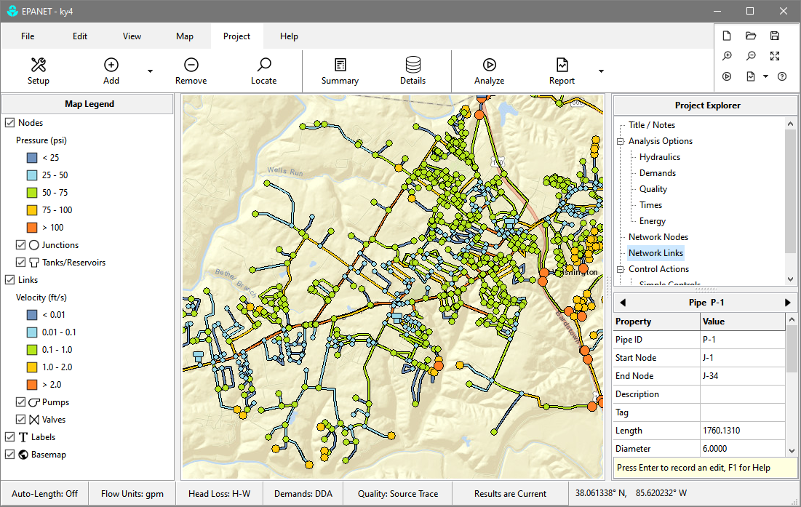

# EPANET Graphical User Interface

EPANET is an industry-standard software package for modeling water distribution systems. It simulates the hydraulic and water quality behavior of a pressurized pipe network over an extended period of time. This project introduces a completely new user interface for EPANET that:
- offers a modern and simple design
- runs on Windows, Linux and MacOS
- has full support for EPANET's multi-species water quality (MSX) extension
- can import data from GIS shapefiles and DXF CAD files
- can use web mapping services to provide background basemaps
- includes additional reporting options for simulation results. 

## Note:
This repository reflects the ongoing effort to create a Lazarus / Free Pascal based user interface for EPANET. Code in this repository has not currently been subjected to EPA's clearance process but is being developed in the open to aid in testing and debugging from internal and external parties. This status will be updated as code is cleared for official release.

The official stable release of EPANET can be found at [EPANET](https://github.com/USEPA/EPANET2.2)

Ongoing development of EPANET engine functionality can be found at [EPANET-engine](https://github.com/USEPA/epanet-engine)

EPA Disclaimer
==============
The United States Environmental Protection Agency (EPA) GitHub project code is provided on an "as is" basis and the user assumes responsibility for its use. EPA has relinquished control of the information and no longer has responsibility to protect the integrity , confidentiality, or availability of the information. Any reference to specific commercial products, processes, or services by service mark, trademark, manufacturer, or otherwise, does not constitute or imply their endorsement, recommendation or favoring by EPA. The EPA seal and logo shall not be used in any manner to imply endorsement of any commercial product or activity by EPA or the United States Government.

By submitting a pull request, you make an agreement with EPA that you will not submit a claim of compensation for services rendered to EPA or any other federal agency. Further, you agree not to charge the time you spend developing software code related to this project to any federal grant or cooperative agreement.
