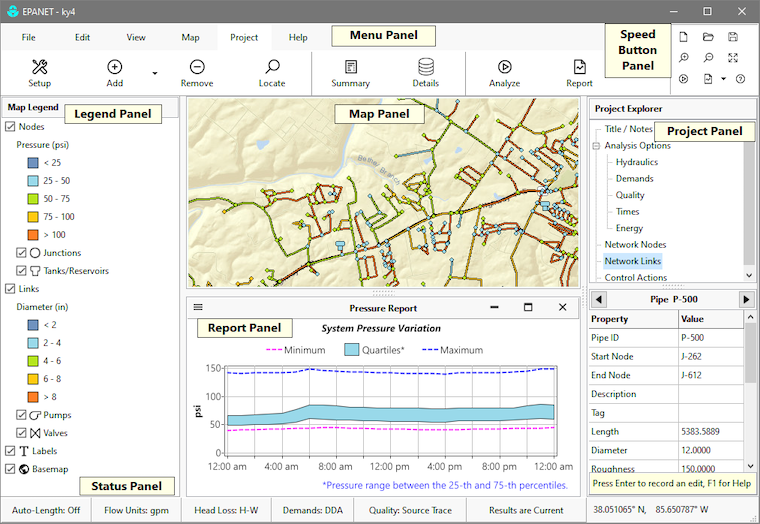

## EPANET'S Workspace

The EPANET workspace is shown in the picture below. It is divided into several panels that display program commands and information about the water distribution system being analyzed.

The **Menu Panel** contains a collection of toolbars that execute various program commands.

The **Speed Button Panel** contains buttons with the most commonly used commands.

The **Project Panel** contains a Project Explorer panel used to select a category of project data and a Property Editor panel used to set the properties of an object belonging to the selected category.

The **Map Panel** displays the layout of the pipe network being analyzed and can include a basemap backdrop to show the network's physical location.

The **Legend Panel** shows the symbology used to color code themes displayed on the map. 

The **Report Panel** displays different types of analysis results. It is normally hidden from view.

The **Status Panel** displays various analysis options chosen by the user as well as the coordinates of the mouse pointer as it is moved across the Map Panel.

## Program Preferences

Program preferences allow you to customize certain program features. To set program preferences select ***Preferences*** from the ***File*** tab of the Menu Panel. A ***Program Preferences*** dialog will appear from which you can select the following options:

**Blinking Map Hiliter**  
Make the selected map object blink on and off.  
  
**Flyover Map Hints**  
Display the ID label and current theme value in a hint-style box whenever the mouse is placed over a node or link on the network map.  
  
**Confirm Deletions**  
Display a confirmation dialog box before deleting any object.  
  
**Show Welcome Page at Start**  
Have a Welcome Page appear whenever EPANET is started.  
  
**Show Speed Bar Buttons**  
Make the Speed Button panel visible.  
  
**Use Office Icons**  
Use MS Office-style icons on the Menu Bar instead of Material Design icons.  
  
**Open Last File at Start**  
Load the last project worked on when EPANET starts.  
  
**Automatic Backup File**  
Save a backup copy of a newly opened project to disk named with a .bak extension.  
  
**Clear Recent Files List**  
Clear the list of most recently opened project files from the File panel.  
  
**Numerical Precision**  
Select the number of decimal places to display for computed results.  
  
The selected preferences will be saved and be applied when EPANET is run again.